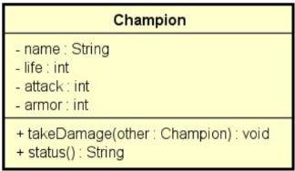

# Desafio 4 DevSuperior - Construtores e Encapsulamento
Quarto desafio do curso Java e Programação Orientada a Objetos Expert do Professor Nélio Alves - Dev Superior.

## Descrição do desafio:
Em um jogo de combate, cada jogador joga com um campeão. Cada campeão possui um nome, uma quantidade de ataque, armadura e vida. 
O combate entre dois campeões é organizado em turnos, de modo que em cada turno, os dois campeões se atacam. 
Você deve fazer um programa para instanciar dois campeões, depois executar N turnos de combate, mostrando a cada turno o estado de cada campeão, conforme exemplos. 
Se em um turno um dos campeões morrer (quantidade de vida igual a zero), o combate deve terminar. Ao final do combate, mostrar na tela "FIM DO COMBATE".

As regras para um campeão A receber dano de outro campeão B é a seguinte:
1) A quantidade de vida do campeão A deve ser decrescida da quantidade de ataque do campeão B, descontada a quantidade de armadura do campeão A. A quantidade de vida resultante não pode ser menor que zero.
2) Independente da quantidade de armadura do campeão A, pelo menos 1 de vida o campeão A deve perder.

Você deve criar uma classe para representar o campeão, conforme projeto abaixo:

### Observações:
- O método takeDamage serve para fazer com que o campeão receba dano advindo do ataque de outro campeão, conforme regras acima.
- O método status deve retornar o nome e a situação de vida do campeão (inclusive com a palavra "morreu" se a vida estiver a zero), conforme exemplos.

## Critérios de avaliação:
- [x] Nomes de classe, atributos, métodos e argumentos respeitando o projeto, bem como as convenções de nome para Java;
- [x] Atributos da classe Champion corretos e devidamente encapsulados com métodos get/set;
- [x] Construtor da classe Champion correto;
- [x] Método takeDamage da classe Champion correto;
- [x] Método status da classe Champion correto;
- [x] Comportamento do programa correto conforme exemplos.

## Competências avaliadas:
- Elaboração de soluções com classes, atributos, métodos e membros estáticos;
- Construtores;
- Encapsulamento, getters e setters.

## Desafios anteriores:
1. https://gist.github.com/paulorc-silva/3953028e80bcd4a808b6d0ee9c275701
2. http://gist.github.com/paulorc-silva/683cb745fc2c3dc04b2090ac887b811e
3. https://github.com/paulorc-silva/Desafio-DevSuperior-Intro-POO